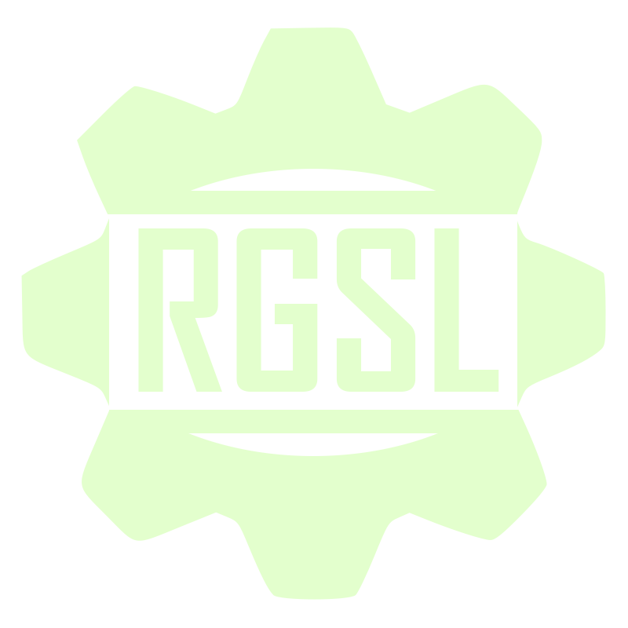

# RGSL - RaeptorCogs Shading Language

<!-- markdownlint-disable MD033 -->
<p align="center">
    
    <br><br>
    <strong>RGSL (RaeptorCogs Shading Language)</strong> is a high-level
    <br>shading language designed for the RaeptorCogs graphics framework.
    <br><br>
</p>
<!-- markdownlint-disable MD033 -->

## RGSL Overview

**RGSL** is a domain-specific language tailored for writing shaders within the RaeptorCogs graphics framework. It provides a simplified syntax and semantics for defining vertex and fragment shaders, making it easier for developers to create complex visual effects without delving into the intricacies of GLSL or HLSL.
Is mainly designed to unify shader development into a single language that can be transpiled to multiple shading languages, facilitating cross-platform graphics programming.
It also let developers use GLSL directly when needed.

## Features

- High-level abstractions for common shader operations
- Support for vertex and fragment shaders

## Roadmap

- [ ] Complete RGSL language specification
- [ ] Implement RGSL to GLSL transpiler
- [ ] Integrate RGSL into RaeptorCogs framework
- [ ] Develop documentation and tutorials
- [ ] Community feedback and iteration
- [ ] Support for additional shading languages (e.g., HLSL, Metal)

## How to Use RGSL

### Basic Usage

```bash
rgsl [options] <input file>...
```

### Command-line Options

**File Options:**

- `-o, --output <file>` - Specify the output file

**Action Options** (choose at least one):

- `-V, --validate` - Validate the input shader file
- `-C, --compile` - Compile the input shader file
- `-S, --spirv` - Compile the input shader to SPIR-V
- `--embed` - Merge input shaders into an embeddable C array

**Miscellaneous Options:**

- `-I, --include <path>` - Add additional include paths
- `-v, --version` - Show version information and exit
- `--verbose <level>` - Set verbosity level (0=quiet, 1=normal, 2=verbose)
- `-h, --help` - Show help message

### Examples

```bash
# Validate a shader file
rgsl --validate shader.rgsl

# Compile to GLSL
rgsl --compile shader.rgsl -o shader.glsl

# Compile to SPIR-V
rgsl --spirv shader.rgsl -o shader.spv
```

## Building

### Requirements

- C++17 or newer
- CMake 3.16 or newer

### Desktop build

```bash
git clone https://github.com/Estorc/RGSL.git
cd RGSL
mkdir build && cd build
cmake ..
cmake --build .
```

## License

RaeptorCogs is licensed under the MIT License.
See the [**LICENSE**](https://github.com/Estorc/RaeptorCogs/blob/main/LICENSE.txt) file for details.
